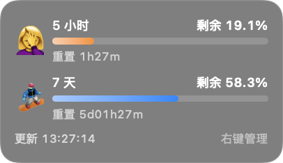

# Kimi 额度 · macOS

让 Kimi Code 的剩余额度留在工作窗口旁。一张小卡片，随时看见还能用多少、多久后重置。

**[下载最新版](https://github.com/Rabbitmeaw/kimi-code-usage-macos/releases/latest)** · [反馈问题](https://github.com/Rabbitmeaw/kimi-code-usage-macos/issues)

## 可以做什么

- **额度一眼可见**：同时展示 5 小时、7 天剩余百分比、重置倒计时和最近成功更新时间，配合彩色额度条与 emoji。
- **跟着窗口走**：固定在 Kimi 窗口四角，移动、缩放时自动跟随；也能切换到自由模式，拖到喜欢的位置并保持置顶。
- **跟随客户端运行**：默认在 Kimi 启动时自动打开，Kimi 退出时自动关闭；也可以关闭自动跟随，保留手动运行。
- **切换应用自然**：固定模式下，前台其他应用可以正常遮挡卡片；无需占用顶部菜单栏，所有操作都在右键菜单里。
- **轻量常驻**：固定模式约每秒检查一次窗口位置，切换应用时立即调整层级；自由模式暂停窗口定位轮询，安装样式未变化时直接复用栏高结果。
- **按自己的习惯显示**：设置 3～6 个额度档位，每档选择一个 emoji，点击彩色圆点修改颜色。
- **外观自由调整**：背景颜色与透明度单独设置；额度条可开启同色浅→深渐变，浅色端混入白色，颜色不随背景透明度变灰。
- **设置自动记住**：档位、颜色、外观、附着模式和自由位置在重启后保留。

这是非官方、独立的开源窗口伴随工具，无需修改 Kimi Code，也不需要辅助功能或屏幕录制权限。

## 下载与安装

需要 **macOS 13 或更新版本**。查看额度时，请打开官方 **Kimi Code App 并登录**。v0.2.1 提供 **Apple Silicon（M 系列）ZIP**；Intel Mac 尚未验证。

1. 从[下载页](https://github.com/Rabbitmeaw/kimi-code-usage-macos/releases/latest)获取 Apple Silicon ZIP 并解压。
2. 将 `Kimi Usage.app` 放入「应用程序」文件夹，即 `/Applications/Kimi Usage.app`。
3. 首次手动双击打开一次，在显示设置中确认默认开启的「跟随 Kimi 自动运行」。轻量后台唤起会随之启用，以后正常打开、退出 Kimi 即可。
4. 打开 Kimi Code 并确认已登录，卡片会显示在 Kimi 窗口旁。该功能只跟随 Kimi，不会替你启动 Kimi。

应用尚未进行 Apple 公证。首次打开被 macOS 拦截时，前往「系统设置 → 隐私与安全」，在本次拦截提示旁选择「仍要打开」，再按系统提示确认。

## 使用

在「访达 → 应用程序」中找到 `Kimi Usage.app`，双击即可打开「Kimi 额度」的显示设置。即使 Kimi 没有运行，也能从这里管理开关与外观。工具不常驻 Dock，也没有顶部菜单栏图标。

右键点击卡片也能管理：

- **附着位置**：选择四角或「自由」。Kimi 隐藏或最小化时，只收起固定卡片，不会退出工具；自由模式保留标题，可拖动，且不要求 Kimi 窗口可见。启用自动跟随时，真正退出 Kimi 会关闭工具，自由模式也遵循这一规则。
- **显示设置**：「跟随 Kimi 自动运行」默认开启。关闭并保存后，后台唤起会停止，当前工具可继续手动运行。背景区域调整背景颜色与透明度；额度条区域设置渐变、档位边界、emoji 和颜色。保存后立即应用，取消不会改变已保存设置。
- **立即刷新／退出**：手动读取最新额度，或关闭工具。手动退出后不会立即被重新打开，自动跟随仍保持开启；持续停用请关闭「跟随 Kimi 自动运行」。

额度约每 60 秒自动刷新，重置倒计时每分钟更新。底部的「更新」是最近一次成功读取数据的时间；读取失败会保留上次真实读数并提示「更新失败」。账号未返回的额度或重置时间会标注「未提供」。

## 后台活动与卸载

自动跟随使用轻量后台唤起，可在 macOS 系统设置的「登录项」中查看或关闭后台活动。它不会在登录 macOS 时自动启动 Kimi；Kimi 已运行时，才会唤起额度工具。

卸载前，请先从「应用程序」打开 Kimi 额度，在显示设置中关闭「跟随 Kimi 自动运行」并保存，再次打开设置并点击「退出 Kimi 额度」，将 `Kimi Usage.app` 移到废纸篓。这样会同时移除自动跟随的后台唤起配置。

## 隐私与兼容性

用量通过本机的 Kimi 官方桌面服务读取。本工具不读取聊天内容，不上传用量或会话数据；登录与账号续期由 Kimi Code 处理。

已验证 **Kimi Code 1.0.4、默认界面缩放**。Kimi 更新或改变页面缩放可能影响数据读取与卡片留距；若出现问题，可在[Issues](https://github.com/Rabbitmeaw/kimi-code-usage-macos/issues)中提供 Kimi 版本和现象。

源码构建、数据来源与诊断方法见[开发文档](docs/DEVELOPMENT.md)。项目采用 [MIT License](LICENSE)；附带的 Unicode emoji 数据保留[第三方许可](THIRD_PARTY_LICENSES/Unicode-LICENSE.txt)。
